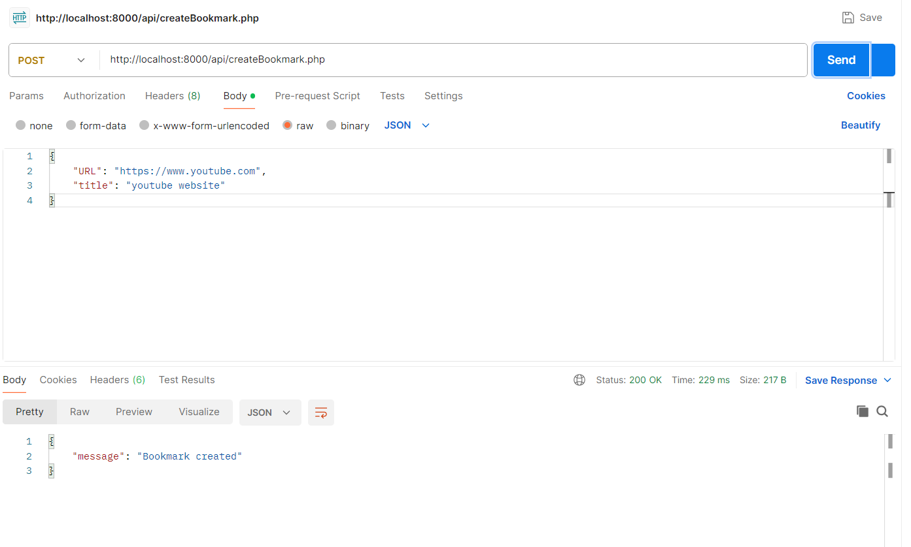
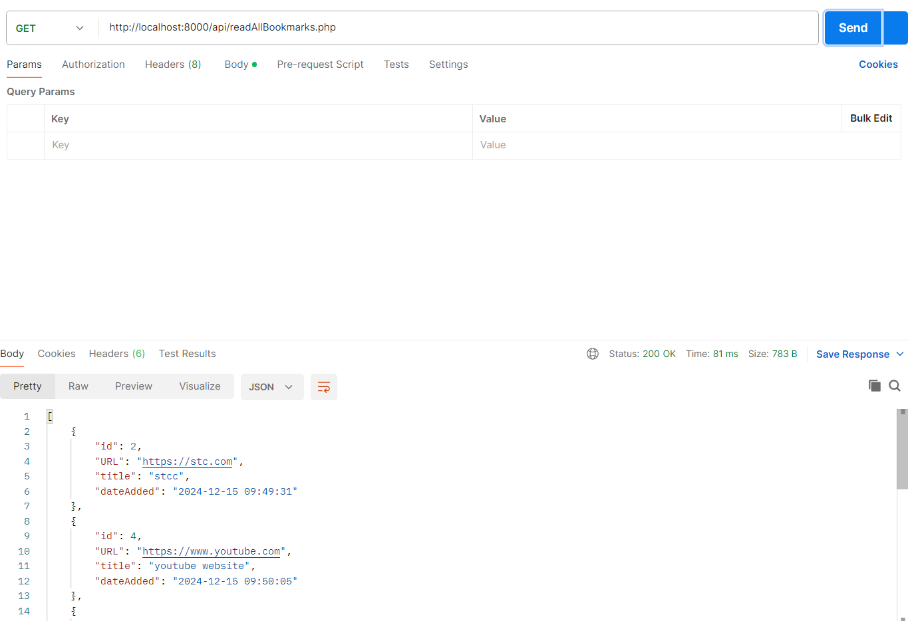
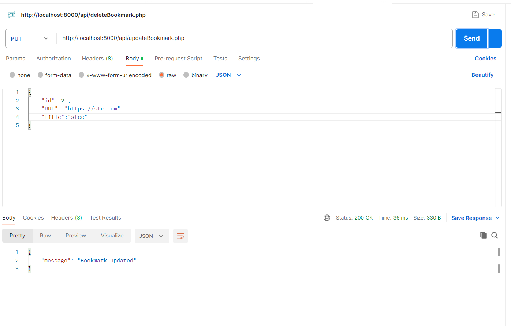
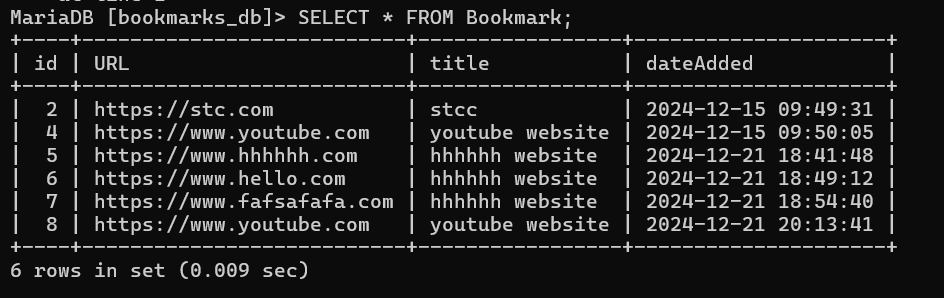
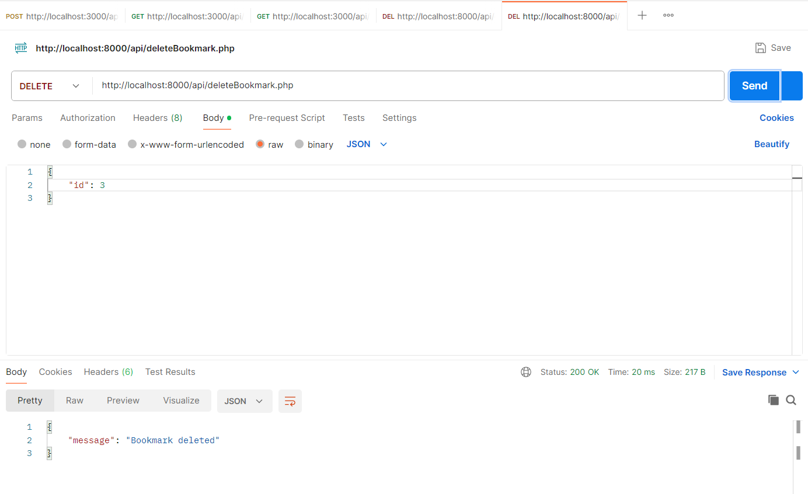
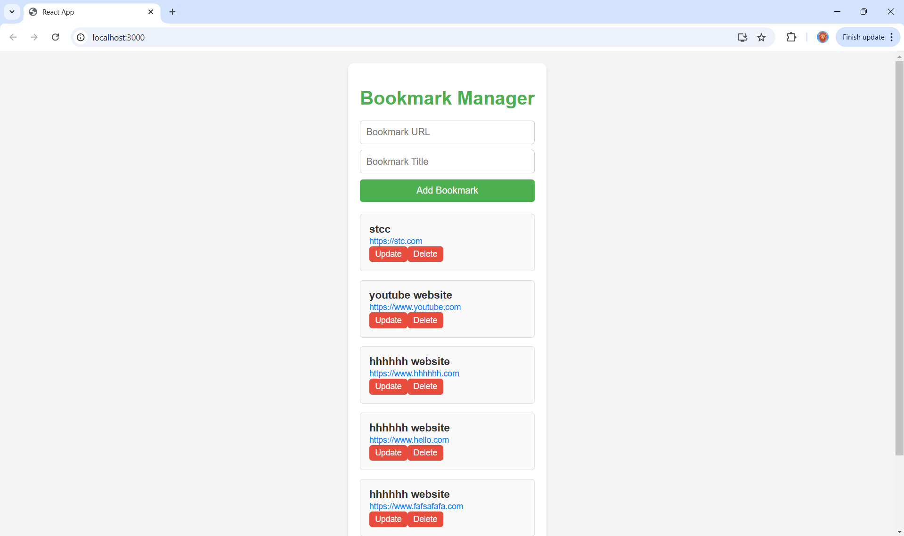

# Bookmark Manager Project

This project is a full-stack application built with a PHP backend and a React frontend for managing bookmarks. It allows users to create, read, update, and delete bookmarks (CRUD functionality).

---

## Features

- **Create** new bookmarks
- **Read** a list of all bookmarks or view details of a single bookmark
- **Update** bookmark details
- **Delete** bookmarks
- **Responsive frontend** using React
- **Backend APIs** implemented with PHP

---

## Technologies Used

- **Frontend**: React (with Axios for API calls)
- **Backend**: PHP (with MySQL for the database)
- **Database**: MySQL

---

1- testing the CRUD in postman:

A- createBookmark:

B- readOneBookmark:

C- readAllBookmarks:

D- updateBookmark:

E- deleteBookmark:

2- the react frontend:
